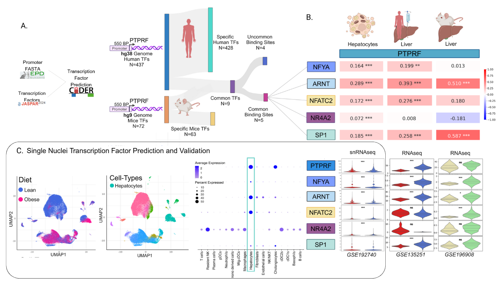

# Single Nuclei Transcription Factor Prediction and Validation in Human Liver Atlas

## Overview

This repository contains a comprehensive single-nuclei RNA sequencing (snRNA-seq) analysis pipeline for investigating transcription factor expression patterns in human liver tissue. The analysis compares hepatic cell populations between lean and obese individuals, with a focus on key metabolic transcription factors including PTPRF, NFYA, ARNT, NFATC2, NR4A2, and SP1.


*Figure: Single-nuclei RNA-seq analysis of PTPRF and associated transcription factors in human liver atlas*

---

## Scientific Background

The project investigates transcriptional regulatory networks in liver cells across different metabolic states. By analyzing single-nuclei transcriptomes from lean and obese individuals, we aim to:

- Identify cell type-specific expression patterns of metabolic transcription factors
- Characterize cellular heterogeneity in human liver tissue
- Understand how obesity affects transcriptional regulation at single-cell resolution
- Validate PTPRF (Protein Tyrosine Phosphatase Receptor Type F) as a key metabolic regulator

---

## Key Features

- **Quality Control Pipeline**: Robust filtering based on gene expression and mitochondrial content
- **Batch Effect Correction**: Integration using Harmony for cross-condition comparison
- **Cell Type Annotation**: Comprehensive mapping to known hepatic cell populations
- **Transcription Factor Analysis**: Focused investigation of 6 key metabolic regulators
- **Publication-Ready Visualizations**: High-resolution UMAP plots and dot plots at 600 DPI

---

## Project Structure

```
├── PTPRF_SingleCell_Validation_Paper_Figure.R   # Main analysis script
├── Dockerfile                                    # Docker environment configuration
├── annot_humanAll.csv                           # Cell type annotations and metadata
├── sncell_ptprf.png                            # Analysis overview figure
├── repo/                                        # Supporting scripts and utilities
└── output/                                      # Generated results (created during analysis)
    ├── UMAP_plot_clusters_600dpi.png           # Cell type UMAP visualization
    ├── UMAP_plot_diet_600dpi.png               # Condition-based UMAP (Lean vs Obese)
    ├── DotPlot_selected_genes_600dpi.png       # TF expression across cell types
    └── expression_data_by_condition.csv         # Quantified expression matrix
```

---

## Analysis Workflow

### 1. Data Loading and Preprocessing
- Load 10X Genomics formatted count matrices
- Create Seurat object with initial quality filters (min.cells=3, min.features=100)
- Calculate mitochondrial gene percentages

### 2. Quality Control
- Filter cells: nFeature_RNA < 5000 and percent.mt < 7.5%
- Remove low-quality and potentially doublet cells

### 3. Normalization and Feature Selection
- LogNormalize with scale factor 10,000
- Identify 5,000 highly variable features using VST method
- Scale data and perform PCA

### 4. Data Integration
- Integrate lean and obese samples using Harmony
- Correct batch effects while preserving biological variation
- Run on first 20 principal components

### 5. Clustering and Visualization
- UMAP dimensionality reduction using Harmony embeddings
- Graph-based clustering at resolution 0.5
- Generate cell type and condition-specific visualizations

### 6. Transcription Factor Analysis
- Extract expression profiles for PTPRF, NFYA, ARNT, NFATC2, NR4A2, SP1
- Create dot plots showing expression across cell types
- Export quantified expression data by condition

---

## Requirements

### Software Dependencies
- **R** (≥ 4.0)
- **Seurat** (≥ 4.0)
- **ggplot2** (≥ 3.3)
- **dplyr** (≥ 1.0)
- **harmony** (≥ 0.1)

### Data Requirements
- 10X Genomics formatted count matrices
- Cell annotation file (`annot_humanAll.csv`) with columns:
  - `cell`: Cell barcode identifiers
  - `annot`: Cell type annotations
  - `diet`: Condition labels (Lean/Obese)

---

## Installation

### Option 1: Docker (Recommended)

```bash
# Clone the repository
git clone https://github.com/yourusername/single-nuclei-tf-analysis.git
cd single-nuclei-tf-analysis

# Build the Docker container
docker build -t single_nuclei_tf .

# Run the analysis
docker run --rm -v $(pwd):/workspace single_nuclei_tf
```

### Option 2: Local R Environment

```r
# Install required packages
install.packages(c("Seurat", "ggplot2", "dplyr"))
install.packages("harmony")

# Run the analysis script
source("PTPRF_SingleCell_Validation_Paper_Figure.R")
```

---

## Usage

### Basic Analysis

```r
# Set data paths
data_dir <- "path/to/countTable_human"
annotations_file <- "path/to/annot_humanAll.csv"
output_dir <- "path/to/output"

# Run the complete pipeline
source("PTPRF_SingleCell_Validation_Paper_Figure.R")
```

### Custom Gene Analysis

```r
# Define your genes of interest
selected_genes <- c("PTPRF", "NFYA", "ARNT", "NFATC2", "NR4A2", "SP1")

# Generate expression plots
DotPlot(liveratlas, features = selected_genes, group.by = "cellType")
```

### Modifying Analysis Parameters

```r
# Adjust quality control thresholds
liveratlas <- subset(liveratlas, 
                     subset = nFeature_RNA < 5000 & 
                             percent.mt < 7.5)

# Change clustering resolution
liveratlas <- FindClusters(liveratlas, resolution = 0.5)
```

---

## Output Files

| File | Description |
|------|-------------|
| `UMAP_plot_clusters_600dpi.png` | UMAP visualization colored by cell type annotations |
| `UMAP_plot_diet_600dpi.png` | UMAP visualization comparing Lean (blue) vs Obese (pink) conditions |
| `DotPlot_selected_genes_600dpi.png` | Expression patterns of transcription factors across cell types |
| `expression_data_by_condition.csv` | Raw expression values for selected genes by condition |

---

## Color Scheme

- **Lean samples**: Royal Blue (#4169E1)
- **Obese samples**: Deep Pink (#FF1493)
- **Expression gradient**: Light Blue to Dark Blue

---

## Troubleshooting

### Common Issues

1. **Memory errors with large datasets**
   ```r
   # Reduce the number of variable features
   liveratlas <- FindVariableFeatures(liveratlas, nfeatures = 2000)
   ```

2. **Missing annotations**
   ```r
   # Check for complete metadata before Harmony
   sum(is.na(liveratlas@meta.data$Condition))
   sum(is.na(liveratlas@meta.data$cellType))
   ```

3. **Harmony integration fails**
   ```r
   # Verify PCA was run successfully
   liveratlas <- RunPCA(liveratlas, verbose = TRUE)
   ```

---

## Citation

If you use this analysis pipeline in your research, please cite:

```bibtex
@article{buss2025ptprf,
  title={Single-nuclei transcriptomic validation of PTPRF as a metabolic regulator in human liver},
  author={Buss, Carlos E and others},
  journal={In preparation},
  year={2025}
}
```

---

## Contributing

Contributions are welcome! Please feel free to submit a Pull Request. For major changes, please open an issue first to discuss proposed modifications.

---

## License

This project is licensed under the MIT License - see the [LICENSE](LICENSE) file for details.

---

## Author

**Carlos E. Buss, PhD**  
Bioinformatics Researcher  
Signal Transduction and Metabolism Laboratory  
Université libre de Bruxelles (ULB)  
Brussels, Belgium  

📧 Email: carlos.eduardo.buss@ulb.be  
🌐 Lab Website: [www.stmlaboratory.com](https://www.stmlaboratory.com)  
💻 GitHub: [@carlosbuss1](https://github.com/carlosbuss1)  

---

## Acknowledgments

- Human Liver Atlas consortium for providing the single-cell data
- STML Laboratory members for scientific discussions
- ULB Erasme Campus computational resources

---

*Last updated: January 2025*
